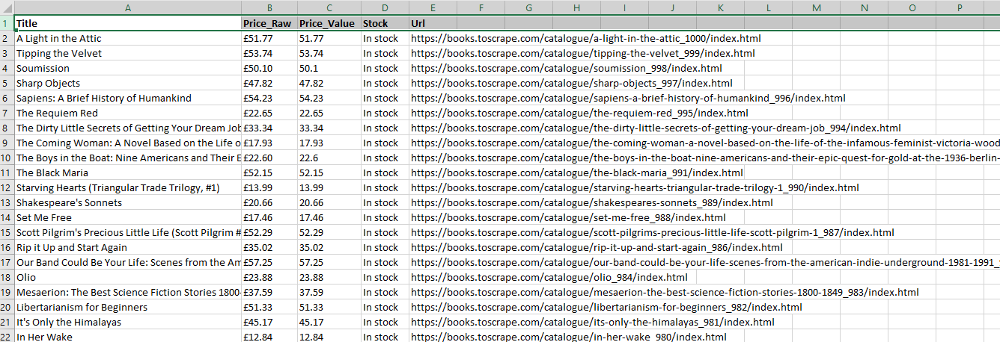

# Simple Scraper (Books to Scrape)

A tiny beginner-friendly web scraping project using **requests** + **BeautifulSoup**.
Targets the demo website **books.toscrape.com** (made for scraping practice).

---

## Preview (Excel)

<p align="center">
  
</p>

---

## Features
- Scrapes book **title**, **price (raw + numeric)**, **stock text**, **URL**
- Pagination (choose number of pages)
- Optional **price filter** (`--max-price 25`)
- CSV output

---

## Requirements
- Python 3.10+ (works with 3.8/3.9 if you replace `float | None` with `Optional[float]`)
- `requests`, `beautifulsoup4`, `lxml`

---

## Install
```bash
python -m venv .venv
# Windows
.\.venv\Scripts\activate
# macOS/Linux
source .venv/bin/activate

pip install -r requirements.txt

Usage
#bash
python scrape_books.py

Options
#bash
python scrape_books.py \
  --pages 3 \            # how many pages to scrape (default: 3)
  --max-price 25 \       # keep only books <= £25 (omit to disable)
  --out cheap_books.csv \# output filename (default: books.csv)
  --delay 1.0 \          # seconds between pages (default: 1.0)
  --start-url https://books.toscrape.com/catalogue/page-1.html
Output
CSV with columns: title, price_raw, price_value, stock, url

Example:
#pgsql

Page 1: 20 rows
Page 2: 20 rows
Page 3: 20 rows
Saved 60 rows to books.csv
```

---

## Notes (ethics & safety)

- This project targets a demo site explicitly built for scraping practice.
- Always be polite: keep a small delay between requests (--delay).
- Do not scrape personal data or violate sites’ robots.txt / Terms of Service.

---
